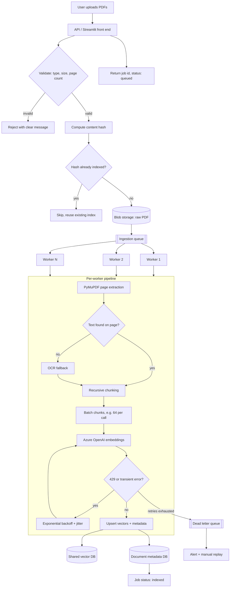

# Workflow 1: Scaling Ingestion

Moving from a single Streamlit process to queue-based, horizontally scalable ingestion. Upload returns immediately, heavy work happens in workers, and the vector store is shared.

## Key decisions

| Concern | Approach |
|---|---|
| Responsiveness | Upload only validates and enqueues; indexing is asynchronous with a pollable job id |
| Idempotency | Content hash prevents re-embedding the same file; upserts use deterministic chunk ids |
| Throughput | Worker count scales with queue depth; embeddings are batched |
| Rate limits | Backoff with jitter; global token-bucket shared across workers |
| Failure isolation | Poison files land in a dead letter queue instead of blocking the queue |
| Consistency | Document is marked `indexed` only after all chunks are upserted |
