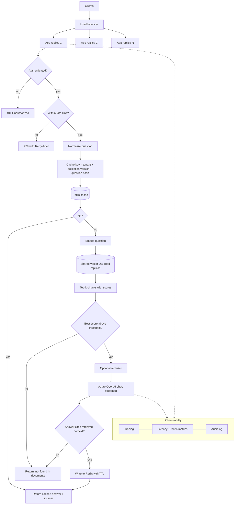
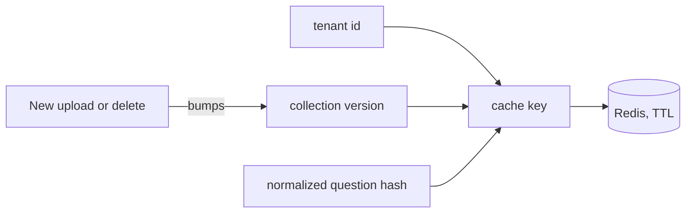

# Workflow 2: Scaling the Query Path

Stateless application replicas behind a load balancer, with a shared Redis cache, per-user rate limits and tracing on every stage.

## Cache key design

Bumping the collection version on any upload or delete invalidates old answers without scanning or deleting keys.

## Scaling levers

| Bottleneck | Lever |
|---|---|
| Azure OpenAI throughput | Provisioned throughput, multiple deployments, regional failover |
| Retrieval latency | Vector DB read replicas, tuned HNSW parameters, metadata filters |
| Token cost | Lower `TOP_K`, reranking, answer cache with TTL |
| Perceived latency | Stream tokens to the UI as they arrive |
| Noisy neighbours | Per-tenant rate limits and quotas |
