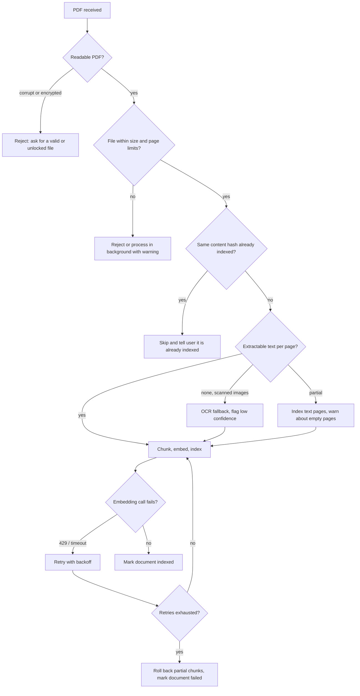
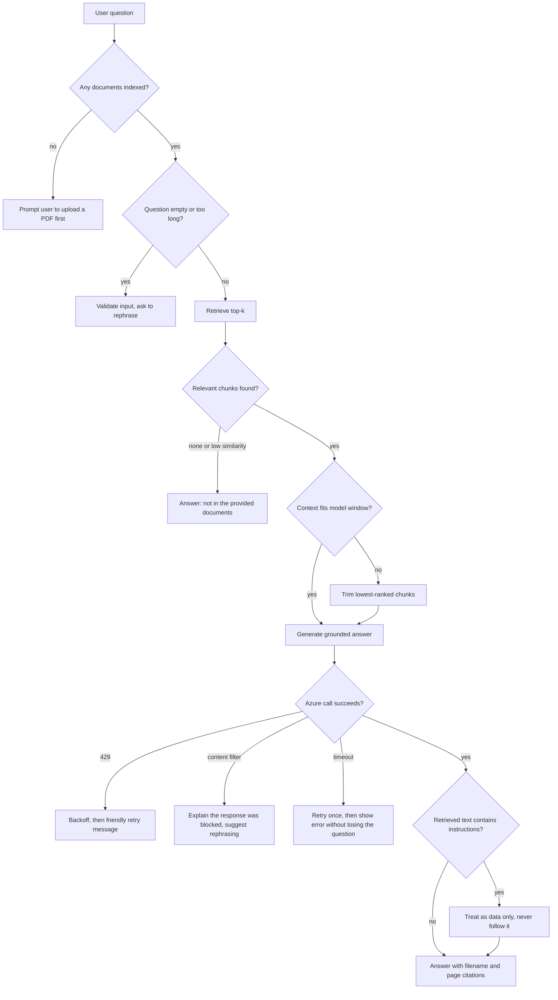
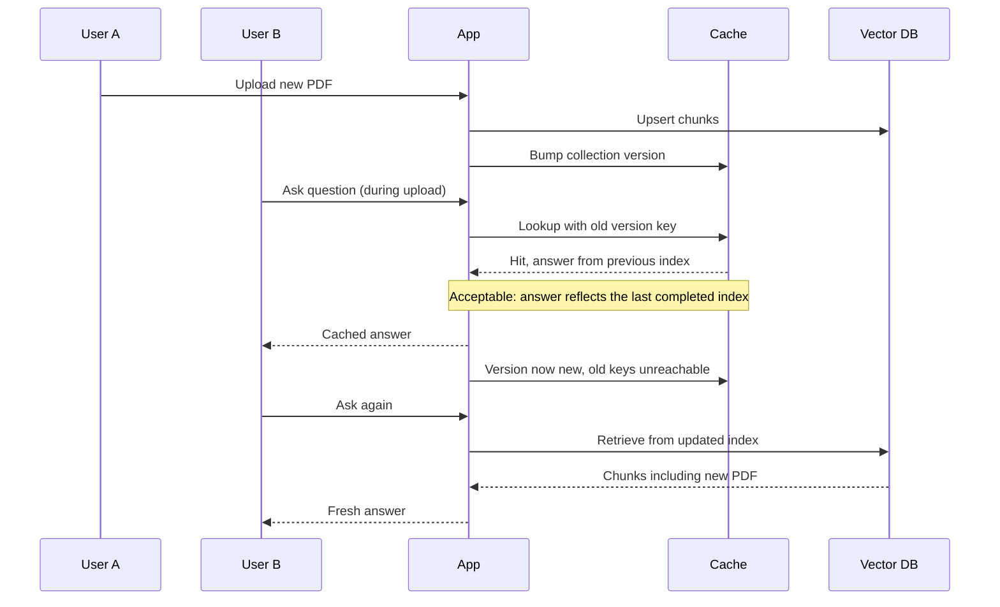

# Workflow 3: Edge Cases and Failure Handling

What the system should do when inputs or dependencies misbehave. Each branch ends in a clear, honest outcome for the user.

## Ingestion edge cases

## Question-time edge cases

## Concurrency and consistency

## Behaviour summary

| Situation | Expected behaviour |
|---|---|
| Scanned or image-only PDF | OCR fallback, or a clear message that no text was found |
| Duplicate upload | Detected by content hash, no re-embedding |
| Answer not in documents | Explicit "not found" instead of a guess |
| Azure 429 or timeout | Backoff and retry, then a friendly error |
| Content filter trigger | Explain and suggest rephrasing |
| Prompt injection inside a PDF | Retrieved text is data only and never treated as instructions |
| Upload during active queries | Collection version bump, no stale cache hits afterwards |
| Process restart | Local LRU cache is lost by design; Redis keeps it in production |
