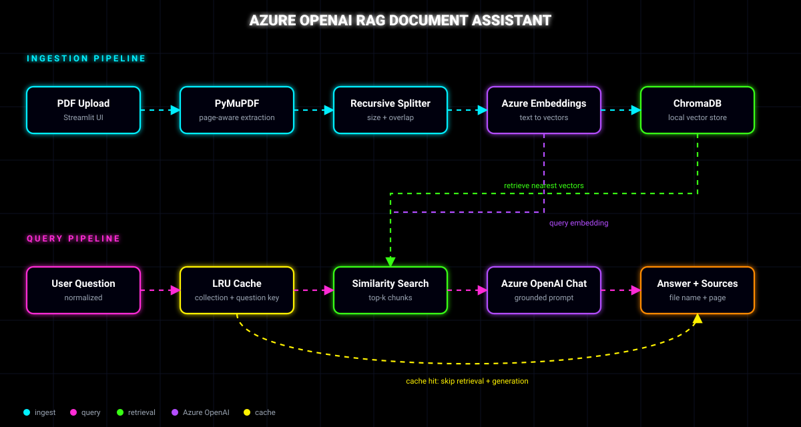
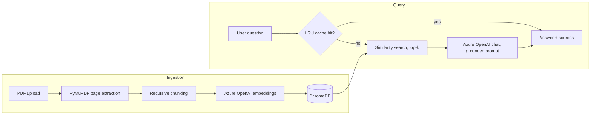

<div align="center">

# Azure OpenAI RAG Document Assistant

**Chat with your PDFs. Grounded answers, page-level citations.**




</div>

---

## Overview

A compact Retrieval-Augmented Generation (RAG) app. Upload one or more PDFs, ask questions in plain English, and get answers that are generated **only** from the retrieved document context, each with the source filename and page number.

**Why it is worth a look**

- Page-aware ingestion, so every citation points to a real page
- Configurable chunking and top-k retrieval from the sidebar
- Strict grounding prompt that refuses to guess when the context has no answer
- Process-local LRU cache that skips repeat generation calls
- Small, readable module layout, easy to explain and extend

---

## Features

| Area | What you get |
|---|---|
| Ingestion | Multi-PDF upload, page-by-page extraction with PyMuPDF |
| Chunking | `RecursiveCharacterTextSplitter` with adjustable size and overlap |
| Embeddings | Azure OpenAI embedding deployment |
| Vector store | Local ChromaDB collection |
| Retrieval | Top-k semantic similarity search |
| Generation | Azure OpenAI chat deployment with a strict grounded prompt |
| Citations | Filename and page number on every answer |
| Performance | In-memory LRU cache keyed by collection fingerprint and normalized question |

---

## Architecture

The animated diagram above shows both pipelines. The same flow in text:



Deeper diagrams for scaling and failure handling live in [`docs/workflows`](docs/workflows):

| Diagram | Covers |
|---|---|
| [Scaling ingestion](docs/workflows/01-scaling-ingestion.md) | Queue-based workers, batched embeddings, shared vector DB |
| [Scaling the query path](docs/workflows/02-scaling-query-path.md) | Redis cache, rate limiting, stateless replicas, observability |
| [Edge cases](docs/workflows/03-edge-cases.md) | Scanned PDFs, empty retrieval, throttling, duplicates, oversize files |

---

## Project structure

```text
azure-openai-rag-assistant/
├── app.py                    # Streamlit UI and orchestration
├── requirements.txt
├── .env.example
├── .gitignore
├── README.md
├── assets/
│   └── architecture.svg      # Animated architecture diagram
├── docs/
│   └── workflows/            # Scaling and edge-case diagrams (Mermaid)
├── ingestion/
│   └── pdf_loader.py         # PyMuPDF extraction into page-level Documents
├── retrieval/
│   └── vector_store.py       # Chroma index and similarity search
├── llm/
│   ├── azure_openai.py       # Chat and embedding clients
│   └── prompts.py            # Grounded answer prompt
└── utils/
    └── cache.py              # LRU response cache
```

---

## Upload to GitHub

1. Open the repo: [azure-openai-rag-assistant](https://github.com/138AP831/azure-openai-rag-assistant)
2. Click **Add file → Upload files**
3. Extract the ZIP first, then upload the **contents** of the folder (including the `assets/` and `docs/` folders, so the README diagram renders)
4. Commit to `main`

Then run it locally:

```bash
pip install -r requirements.txt
```

Create `.env` from `.env.example`, add your Azure OpenAI credentials, then start the app:

```bash
streamlit run app.py
```

> **Important:** the ZIP contains only `.env.example`. Your Azure API key is not included, and your real `.env` must never be committed.

---

## Quick start

### 1. Azure OpenAI resources

Create an Azure OpenAI resource and deploy two models:

- a **chat** model deployment
- an **embeddings** model deployment

### 2. Configure environment

```bash
cp .env.example .env
```

```ini
AZURE_OPENAI_ENDPOINT=https://YOUR-RESOURCE.openai.azure.com/
AZURE_OPENAI_API_KEY=YOUR_KEY
AZURE_OPENAI_CHAT_DEPLOYMENT=YOUR_CHAT_DEPLOYMENT
AZURE_OPENAI_EMBEDDING_DEPLOYMENT=YOUR_EMBEDDING_DEPLOYMENT
AZURE_OPENAI_API_VERSION=2024-10-21

CHUNK_SIZE=900
CHUNK_OVERLAP=150
TOP_K=4
```

> Never commit a real `.env` file or API key. Keep `.env` in `.gitignore`.

### 3. Install and run

```bash
python -m venv .venv

# Windows
.venv\Scripts\activate
# macOS / Linux
source .venv/bin/activate

pip install -r requirements.txt
streamlit run app.py
```

### Configuration reference

| Variable | Default | Effect |
|---|---|---|
| `CHUNK_SIZE` | `900` | Characters per chunk. Larger gives more context per chunk but coarser retrieval |
| `CHUNK_OVERLAP` | `150` | Characters shared between neighbouring chunks, protects sentences split at boundaries |
| `TOP_K` | `4` | Chunks sent to the model. Higher raises recall and token cost |

---

## How it works

1. **Ingestion.** Each PDF page is extracted on its own and stored as a LangChain `Document` with `source` (filename) and `page` metadata.
2. **Chunking.** `RecursiveCharacterTextSplitter` splits on paragraph, then line, then word boundaries, with overlap so context is not lost at the seams.
3. **Embedding and indexing.** Chunks are embedded with Azure OpenAI and written to a local ChromaDB collection.
4. **Retrieval.** The question is embedded with the same model and the top-k nearest chunks are returned.
5. **Grounded generation.** A strict prompt instructs the model to answer only from the retrieved context and to say so explicitly when the answer is not present.
6. **Citations.** Filename and page from chunk metadata are shown beside the answer.
7. **Caching.** Identical questions against the same document set return from an in-process LRU cache. The key combines a collection fingerprint with the normalized question, so uploading new documents invalidates stale answers.

---

## Interview talking points

<details>
<summary><b>Design choices</b></summary>

- Why RAG instead of fine-tuning: fresh data, no training cost, citations come for free
- Why a vector database: fast approximate nearest-neighbour search over embeddings
- How embeddings capture semantic similarity: nearby vectors mean related meaning, even without shared keywords
- Why recursive chunking with overlap: keeps semantic units intact and avoids losing facts at chunk edges
- How top-k trades recall against context size, cost and noise

</details>

<details>
<summary><b>Performance and cost</b></summary>

- Reduce latency: cache, smaller `TOP_K`, streaming responses, batched embedding calls
- Reduce tokens: tighter chunks, reranking, trimming context before generation
- Replace the process-local cache with Redis so replicas share hits

</details>

<details>
<summary><b>Scaling and operations</b></summary>

- Move from local ChromaDB to a shared store such as Azure AI Search, pgvector or a managed Chroma/Qdrant
- Add authentication, per-user rate limiting, monitoring and audit logs
- Evaluate retrieval quality (recall@k, MRR) separately from generation quality (faithfulness, answer relevance)

</details>

---

## Production roadmap

- [ ] Shared, managed vector store
- [ ] Redis for distributed caching
- [ ] Persistent document metadata (database)
- [ ] Authentication and authorization, per-tenant collections
- [ ] Observability: tracing, token and latency metrics
- [ ] Rate limiting and retry with backoff for Azure 429s
- [ ] Background ingestion jobs
- [ ] Automated evaluation suite with a golden question set
- [ ] OCR fallback for scanned PDFs

See the [workflow diagrams](docs/workflows) for how these fit together.

---

## Security notes

- Secrets live in `.env` only and are never committed
- Retrieved text is treated as untrusted data, and the prompt tells the model to ignore instructions found inside documents
- Uploaded files are processed locally and are not sent anywhere except the Azure OpenAI endpoint you configure
